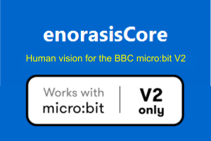

# enorasis-core



**Human vision for the BBC micro:bit V2.** Connect browser-based machine learning to your MakeCode projects.

> **This extension requires the micro:bit V2 hardware.** It uses Bluetooth, which is only available on micro:bit V2. On a micro:bit V1 the program will display the **927** error code.

Train image classes in [enorasisCore](https://enorasiscore.eu) (no install). When the AI recognises what the camera sees, it sends a **class label** over Bluetooth to your micro:bit. Your blocks turn that label into action — servos, motors, LEDs, and logic.

| | |
|---|---|
| **Product** | [enorasiscore.eu](https://enorasiscore.eu) |
| **License** | [MIT](LICENSE.txt) |
| **Board** | BBC micro:bit **V2** only |
| **Install** | `https://github.com/skinformatics/enorasisCore-makecode` |

---

## Educational purpose

The micro:bit is excellent for physical computing, but it cannot **see** objects the way people do. This extension closes that gap for schools:

1. **Camera** (phone or computer) captures the world.
2. **Machine learning** in the browser (enorasisCore) classifies images into classes you define.
3. **Bluetooth** delivers the class name to the micro:bit.
4. **MakeCode blocks** (this extension) run your response.

The neural network runs in the **browser**, not on the micro:bit — keeping projects fast, simple, and suitable for classrooms. Students learn the full STEM path: **data → train → inference → actuate**.

This pattern matches many real systems: smart sensing on a capable device, control on a small board.

---

## How it works

```
  Camera          enorasisCore (browser ML)       micro:bit V2
 ┌────────┐       ┌─────────────────────┐        ┌──────────────┐
 │ image  │ Train │ classify → label    │  BLE   │ your blocks  │
 │ input  │ Test  │ e.g. "left", "red"  │ ─────► │ servo, LED…  │
 └────────┘       └─────────────────────┘        └──────────────┘
```

**Protocol (fixed):** Nordic UART service; each message is a UTF-8 **class name** followed by a newline character (`\n`). Connect only from enorasisCore in Chrome or Edge (Web Bluetooth).

---

## Install

1. Open [makecode.microbit.org](https://makecode.microbit.org/).
2. Create a **New Project**.
3. Open **Extensions** (gear menu).
4. Paste: `https://github.com/skinformatics/enorasisCore-makecode`
5. Select **enorasis-core**.
6. Build your program, **Download** the `.hex`, and flash the micro:bit.

**macOS users:** Project Settings → enable **No Pairing Required** → Save → Download again.

**Workflow:** Train classes at [enorasiscore.eu](https://enorasiscore.eu) → Connect micro:bit → Test → blocks run on each recognised class.

---

## Blocks reference

| Block | Description |
|-------|-------------|
| `start enorasisCore BLE` | Start UART service; ready icon on display. |
| `on enorasisCore connected` | Runs when enorasisCore connects over Bluetooth. |
| `on enorasisCore disconnected` | Runs when Bluetooth disconnects. |
| `on enorasisCore class received` | Runs when **any** class label is received. |
| `on enorasisCore class %className received` | Runs when a **specific** label is received. |
| `last enorasisCore class` | Returns the last label (`string`). |
| `enorasisCore class is %name` | Returns `true` if the last label equals `name`. |

Block help pages: see the `docs/` folder (`start`, `last-class`, `on-class-received`, and others).

---

## Examples

### Colours → servo

Train classes `red`, `green`, and `blue` in enorasisCore. Use the **same names** in MakeCode.

```blocks
enorasisCore.start()
enorasisCore.onClassReceived("red", function () {
    pins.servoWritePin(AnalogPin.P0, 0)
    basic.showIcon(IconNames.Heart)
})
enorasisCore.onClassReceived("green", function () {
    pins.servoWritePin(AnalogPin.P0, 90)
})
enorasisCore.onClassReceived("blue", function () {
    pins.servoWritePin(AnalogPin.P0, 180)
})
```

### Direction arrows (classroom tested)

Train `left`, `right`, and `nothing`. Verified on BBC micro:bit V2 with enorasisCore BLE.

```blocks
enorasisCore.start()
enorasisCore.onClassReceived("left", function () {
    pins.servoWritePin(AnalogPin.P0, 0)
    basic.showArrow(ArrowNames.West)
})
enorasisCore.onClassReceived("right", function () {
    pins.servoWritePin(AnalogPin.P0, 180)
    basic.showArrow(ArrowNames.East)
})
enorasisCore.onClassReceived("nothing", function () {
    pins.servoWritePin(AnalogPin.P0, 90)
})
```

### Any class with conditional

```blocks
enorasisCore.start()
enorasisCore.onAnyClassReceived(function () {
    if (enorasisCore.classIs("stop")) {
        basic.showIcon(IconNames.No)
    }
})
```

---

## Dependencies

- `core` (micro:bit)
- `bluetooth` (UART service — included automatically)

---

## Author

[sk.informatics](https://enorasiscore.eu) — enorasisCore browser machine learning platform.

MIT License. See [LICENSE.txt](LICENSE.txt).

```package
enorasis-core=github:skinformatics/enorasisCore-makecode
```

```text
for PXT/microbit
```
